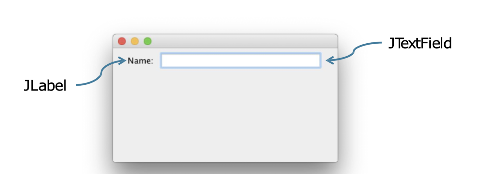
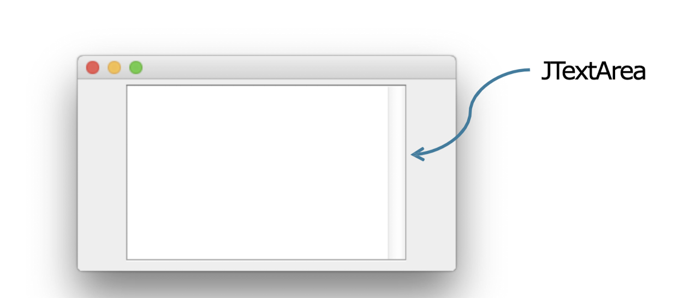
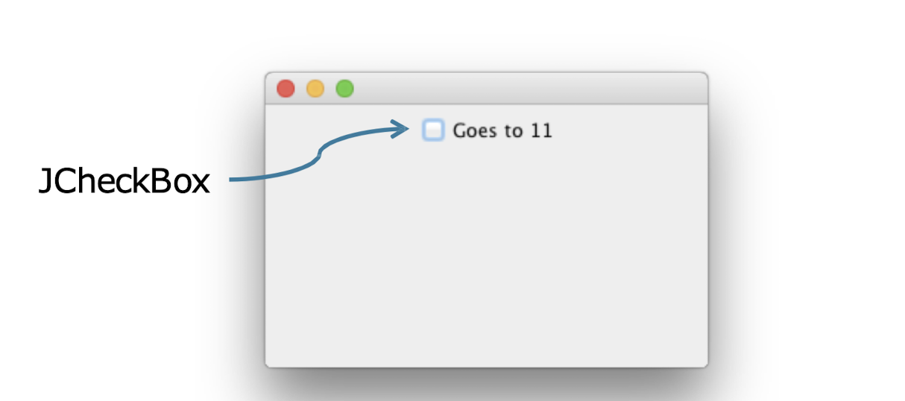
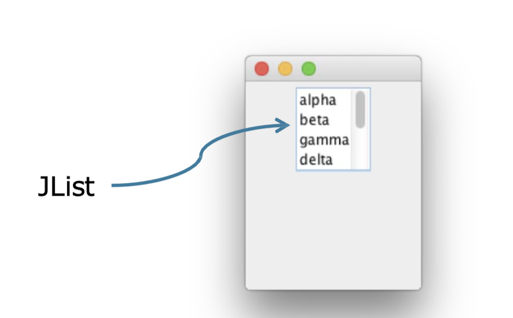
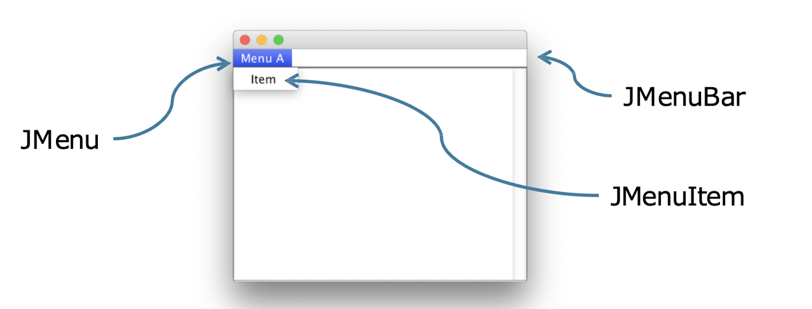
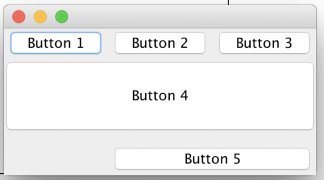
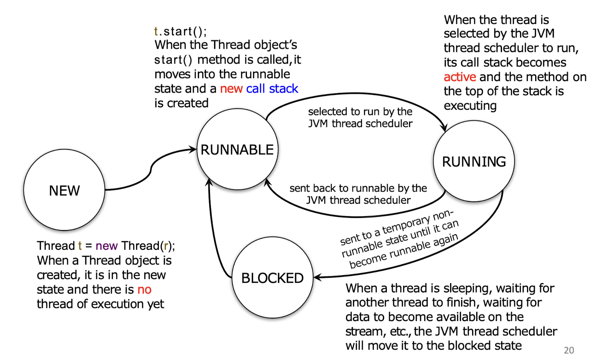
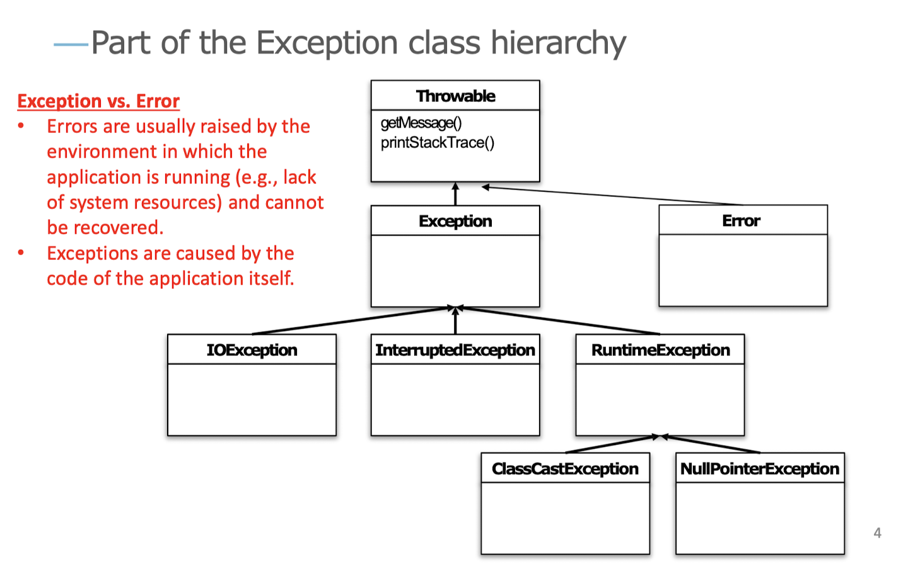

# COMP2396: Object-oriented Programming and Java

## Fundamental OOP Concepts 
1. Abstraction
2. Encapsulation
3. Inheritance
4. Polymorphism

## Advantages of OOP

**1. Modularity: Code can be written and maintained independently** \
**2. Information Hiding: Objects' internal implementation remains hidden** \
**3. Code re-use: The code for an existing object can be reused either directly or through inheritance** \
**4. Pluggability: Problematic objects can be easily replaced** 

## Class and Object

- Classes and objects are the basic building blocks in OOP
- A class is not an object, but a **blueprint** for an object
- An **instance** (object made from a certain class) would have:
  1. Some data stored: **state**
  2. Some operations it can do: **behavior**


## A Java Application

- Java is a language that is:
  - compiled
  - **strongly statically-typed**
  - object-oriented 
  - run in Java Virtual Machine (JVM)
- A Java application is nothing but objects talking to each other
- In most Java application, the `main()` method only does 2 things:
  - Create an object (instantiation)
  - Call a method of the object

```java
public Hello {
    public static void main(String[] args) {
        System.out.println("hello, world");
    }
}
```
Comparing to c++:
```cpp
int main(int argc, char* argv[]) {
    std::cout << "Hello, world" << std::endl;
    return 0;
}
```

Points to note:
1. `main()` method in Java does not return any value
2. the name of the program is excluded from the arguments (`String[] args`)

### Garbage Collection in Java

- Java manages the memory for you
- Each time an object is created in Java, it goes into the heap (a **garbage-collectible heap**)
- The Garbage Collector in Java would remove unreachable objects (i.e., no reference variables to this object) automatically. (When the system is running low on memory)

## Variables in Java

In Java, data types can be classified into **primitives** and **object references**, which would determine the memory space and the way of interpreting the data stored in the variables.

### Variable declaration
- A variable is declared by specifying its type and name. e.g., `int x; Dog y;`
- Rules in naming variables
  - Don'ts:
    1. start with a number
    2. be a reserved keyword in Java (e.g., `int`, `byte`, `extends`,...)
  - Dos: (standard naming conventions)
    1. classes: begin with a capital letter
    2. variables/methods: begin with a lowercase letter
    3. symbolic constants: only capital letters
    4. names consisting of multiple words are joined together with each subsequent word begins with a capital letter (`lowerCamelCase`)

### Primitive variables

- Primitives: fundamental values including integers, booleans and floating point numbers.

- Java supports 8 primitive types

| Type | Bit depth | value range |
|------|-----------|-------------|
| 1. `boolean` | JVM-specific | false or true |
| 2. `char` | 16 bits | [0, 65,535] |
| 3. `byte` | 8 bits | [-128, 127] |
| 4. `short` | 16 bits | [-32768, 32767] |
| 5. `int` | 32 bits | [-2147483648, 2147483647] |
| 6. `long` | 64 bits | [-2^(63), 2^(63)-1]
| 7. `float` | 32 bits | varies |
| 8. `double` | 64 bits | varies |

- *Note: when assigning `float` to a variable, an `f` should be added behind the literal, or it will be treated as a `double`. 
- Assigning literals with a wider-range data types to a variable declared with a narrower-range data type is not allowed. However, type casting allows it to be done. (information loss may happen)
```java
int x = 24;
float f = 32.5; // type mismatch
byte b = (byte) x; // valid conversion
```

### Object References

- Hold bits that references the objects living in the *heap*
- A reference variable is like a remote control, and using the dot operator on a reference variable is like pressing a button on the remote control.

**Declaration, creation and assignment**
```java
Dog myDog = new Dog();
```


## State and Behavior

In OOP, each object would contain:
  1. Instance variables → state of object
  2. Methods → behavior of object
- Every instance is unique and may have its own state and behavior (Instances of the same class has the same set of methods, but they can behave differently depending on the values of the instance variables)
- Java uses **pass-by-value** mechanism for passing parameter into a method.
- Methods other than *constructors* must have a return type (including `void`)

### Getters and Setters: How to achieve encapsulation

- A getter is a method for getting the value of an instance variable
- A setter is a method for setting the value of an instance variable
- `public` getters and setters are provided for accessing the `private` instance variable from outside the object. 
    - This prevents instance variables from being changed to unacceptable values from outside the object
    - With getters, setters and private variables, ***encapsulation*** can be achieved.

```java
class Dog {
    private double size; // it cannot be accessed outside the object directly
    double getSize() { // getter
        return size;
    }
    void setSize(size) { // setter 
        if (size > 0) { // check if the input is valid
            this.size = size // assignment
        }
    }
}
```

### Constructors

- Called automatically on instantiation of an object, before assigning to a reference
- must have the same name as the class
- must not have any return type, not even `void`
- cannot be called using the dot operator
- If no constructor is defined for a class, the compiler assumes a default constructor
- A class may have more than one constructor as long
-  as each constructor has a different argument list (order is important) → concept of **overloaded methods**
- The compiler will not assume the default constructor if one or more constructors have been defined.
```java
public class Duck {
    private int size = 30;
    private String name = "Donald";

    public Duck() {} // default constructor
    public Duck(int size) { this.size = size; }
    public Duck(String name, int size) {
        this.name = name;
        this.size = size;
    }
}
```
- When an object of a subclass in created, its constructor will immediately call its superclass's **no-argument constructor** up to `java.lang.Object` (the ultimate superclass) 
  - Thus constructors are not inherited
  - The compiler will raise error if a class inherits a class without a no-argument constructor 

*Solution 1:* provide a no-argument constructor
```java
public class Animal {
    public Animal(int n) { ... }
    public Animal() { ... } 
}
```
```java
public Pig extends Animal {
    private int size = 90;
    private String name = "Peppa";
}
```

*Solution 2:* explicit call to the constructor using `super`
```java
public class Animal {
    public Animal(int n) { ... }
}
```
```java
public Pig extends Animal {
    private int size = 90;
    private String name = "Peppa";
    public Pig {
        super(3); 
    }

}
```

### `static` keyword

1. Static variables
- shared by **all** instances of a class (i.e., one copy per class)
- initialized **only** when the class is first loaded
- can be accessed using the class name, e.g., `Math.PI` from `java.lang.Math`
- can be used inside static methods

2. Static methods
- cannot use **any** instance variables, not even within the same class
- cannot use non-static methods since they behave differently depending on the values of the instance variables
- are called using the class name, e.g. `Math.log(double a)` from `java.lang.Math`

### `final` keyword

1. Final variables
- value cannot be changed once initialized
- do not get a default value
- must be initialized at declaration by direct assignment or in the constructor
- can be used to define a constant using `public static final`:
  - must be initialized either at the time it is declared or in a static initializer

```java
// a static final variable
public class Foo {
    public static final int FOO_X;
    static { // runs before any static method can be called and before any static variables can be used
        FOO_X = 25;
    }
}
```

2. Final method
- a method that cannot be *overridden* in a subclass (relating to inheritance)
  
3. Final class
- a class that cannot be *extended* (cannot have any subclass)
  
### Instance and Static Variables
- Declared within a class
- Always get a default value if no value has been explicitly assigned to it. 
  - primitives: `0` or `0.0` or `false`
  - object references: `null`

### Local Variables
- Declared within a method
- Do **not** get a default value
- Must be initialized before use (will raise error otherwise)

### Comparing Variables
- comparing primitives: `true` if the **bit patterns** are the same (primitive types are unimportant)
- comparing objects: `true` if the two variables are referencing the same object on the heap


## Inheritance

### Designing an Inheritance Tree
1. Look for objects that have common attributes and behaviors
2. Design a class that represents the common state and behavior
3. Decide if a subclass needs behavior that is specific to that particular subclass type
4. Look for more opportunities to use abstraction by finding 2 or more subclasses that might share common behavior

### Access Levels


### Method Overriding
- When a subclass overrides a method, it must make sure that
  - argument list must be the same
  - return type must be compatible
  - cannot be less accessible (in terms of access level)

```java
public class Dog {
    public void makeNoise() {
        System.out.println("Woof!");
    }
}
public class Poodle extends Dog {
    @Override
    public void makeNoise() {
        System.out.println("Ruff! Ruff!");
        /*
        same argument lists: Empty
        same return types: void
        same access levels: public
        */
    }
}
```
- When a method is called on an object reference, the JVM starts walking up the inheritance hierarchy until it finds a match (from the bottom to the top)
- It is possible to call an overridden method of the superclass using the keyword `super` (`super.method()`)

### Method Overloading

- For overloaded methods, the argument lists must be different, while return types, and access levels could be different 
- It has nothing to do with inheritance and polymorphism

```java
public class Dog {
    public void makeNoise() {
        System.out.println("Woof!");
    }
}
public class Poodle extends Dog {
    public void makeNoise(int n) {
        for (int i = 0; i < n; i++) {
            System.out.println("Ruff! Ruff!");
        }
    }
}
```

### Benefits of inheritance
1. Avoid duplicate code by extending classes
2. Handle specialization by overriding methods
3. Define a common protocol for a group of classes

## Polymorphism

### The way polymorphism works
- The reference type can be a superclass of the actual object type
- Any object that is the subclass of the declared type of the reference variable can be assigned to that reference variable.
```java
Dog myDog = new Poodle();
/*
The reference variable type is declared as Dog,
but the object created is a Poodle object.
*/
```
### Benefits of Polymorphism
- Makes it possible to write code that does not have to change when new **subclass types** are introduced
    - e.g., the array can store any subclass of the specified class (polymorphic arrays)

```java
public class Vet {
    public void giveShot(Dog a) {
        a.makeNoise();
    }
}
public class PetOwner {
    public void start() {
        Vet v = new Vet();
        Poodle d = new Poodle();
        v.giveShot(d);
    }
}
```

## Abstract Classes and Interfaces

### Abstract Classes and Methods
**Abstract Classes:**
- It is forbidden to instantiate an abstract class object using the `new` operator
- When designing an inheritance tree, one must decide which classes are abstract and which are concrete 

**Abstract Methods:**
- An abstract class means the class must be extended, whereas an abstract method means the method must be overridden
- An abstract method has no method body, just ends with a semicolon.
- It is illegal to have an abstract method in a *non-abstract* class
- A **concrete** class in the inheritance tree must implement all abstract methods from its superclass 
- An **abstract** class may not implement all the abstract methods from its superclass 

```java
abstract class Animal { // abstract class
    public void makeNoise() { // non-abstract method
        System.out.println("...");
    }
    public abstract void eat(); // abstract method
}

```

### Interface: Solution to Multiple Inheritance

- Java does not allow multiple inheritance (the Deadly Diamond of Death), instead, it is achieved through **interface**.
- A class can implement multiple interfaces
- Like abstract class, interface cannot be instantiated
```java
public interface Pet {
    // interface methods are implicitly public and abstract
    void beFriendly();
    void play();
}
```
- A class implementing the interface must implement all the interface methods so that the JVM will not be confused about which of the 2 inherited versions it is supposed to call. 
```java
public class Dog extends Animal implements Pet {
    // implemented methods
    public void beFriendly() { ... }
    public void play() { ... }
    // normal overriding methods
    public void makeNoise() { ... }
    public void eat() { ... }
}
```

### Interface as a Polymorphic Type

An object can be treated by the role it plays, rather than by the class type from which it was instantiated. 

```java
class Dog extends Animal implements Pet {
    public void beFriendly() { ... };
    public void play() { ... };
}
class Cat extends Animal implements Pet {
    public void beFriendly() { ... };
    public void play() { ... };
}

public class InterfaceTest {
    public static void main(String[] args) {
        // interface typed reference variables --> classes that implemented that interface
        Pet d = new Dog();
        Pet c = new Cat();
    }
}
```


## Packages: `ArrayList`

### Arrays

- An array of primitives
```java
int[] nums = new int[4]; // instantiate an array object only
int[] nums = {6, 19, 44, 42}; // instantiate and assign values
```
- An array of objects
```java
Dog[] myDogs = new Dog[3]; // instantiate array only
myDogs[0] = new Dog(); // instantiate a Dog object
myDogs[1] = new Dog();
myDogs[2] = myDogs[0]; // reference the same Dog() object as myDogs[0]
```

- Limitations of arrays in Java
1. no methods
2. only one instance variable: `length`
3. size must be determined at the time of creation, and cannot be changed afterwards
4. data can be put into and read from an array using array syntax, but cannot be actually removed from the array

### `ArrayList`

- a class in the core Java library `java.util` (the API)
- Advantages:
1. dynamic list size
2. more methods allowed, including searching for, adding and removing items
- Declaration:
```java
ArrayList<MyType> myList = new ArrayList<MyType>();
```
- Methods:
1. `add(Object elem)`
2. `remove(int index)`
3. `remove(Object elem)`
4. `contains(Object elem)`
5. `isEmpty()`
6. `indexOf(Object elem)`
7. `size()`
8. `get(int index)`
9. ...

### Packages
- In the Java API, classes are grouped into packages like `ArrayList`
- Importance:
  - helps the overall organization
  - name-scoping that helps to prevent collisions of names
  - provide a level of security by allowing placing restrictions on code
- A class in Java has a full name = package name + class name
- To use a class in a package other than `java.lang`, the full name of the class must be specified (e.g., `java.util.ArrayList` every time you use it), unless the package has been imported using `import` statement
```java
import java.utils.*; 
```

## Wrapper Classes
- The type parameter of an `ArrayList` supports classes only, so wrapper class is used for every primitive type
- Wrapper classes are in the `java.lang` package

| Primitive Type | Wrapper Class |
|----------------|---------------|
| `boolean` | Boolean |
| `char` | Character |
| `byte` | Byte |
| `short` | Short |
| `int` | Integer |
| `long` | Long |
| `float` | Float |
| `double` | Double |

### Wrapping and Unwrapping
```java 
int i = 167;
Integer iWrap = new Integer(i); // wrapping
int iUnwrap = iWrap.intValue(); // unwrapping
```

### Autoboxing
- Performs the conversion from primitives to wrapper objects, and vice versa, automatically
- This feature blurs the line between primitives and wrapper objects
- That is: `int` ⇔ `Integer`
- **\*Note**: if an `Integer` object is not referencing any valid `Integer` object, autoboxing would fail and result in a `NullPointerException`;

```java
Integer i;
int j = i; // will blow up at runtime 
```
### String to Primitive by parsing
- The wrapper classes have static parse methods that take a string and return a primitive value
- **\*Note**: If something that cannot be parsed as a certain primitive values is passed into a static parse methods, the program will throw a `NumberFormatException`:
```java
String t = "two";
int y = Integer.parseInt(t); // will blow up at runtime
```

### Primitive to String
- Two ways to turn a number into a string: concatenation and `toString()` method
```java
double d = 42.5;
String doubleString1 = "" + d; // Method 1: using concatenation
String doubleString2 = Double.toString(d); // Method 2
```

### Number formatting

- Call `String.format()` to format string with numbers, e.g. `String s = String.format("Hello COMP%d", 2396)`

- Some common format specifiers
1. `%,d` - insert comma and format the number as a decimal integer
2. `%.2f` - format the number as a 2-decimal-place floating point
3. `%,5.2f` - insert comma and format the number as a 2-decimal-place floating point with a minimum of 5 characters
4. `%h` - format the number as a hexadecimal
5. `%c` - format the number as a character

## The Ultimate Superclass: Object (`java.lang.Object`)

### Some methods of `Object` 

- `equals()`: return `true` only if they are referencing the same object (can be overridden)
- `hashCode()`: return a hash code value (integer) for the current object (done by converting the internal address)
- `getClass()`: return a Class object that represents the runtime class of the current object (final method)
- `toString()`: return a string ( \{className\}@\{hashCode\}) that textually represents the current object (recommended being overridden)

### Using `Object` as a polymorphic type

#### Pros
- With the Object class being the superclass of everything, it is possible to create a list that can store anything (like `ArrayList<Object>`).

#### Cons
- Defeats the whole point of "type-safety"
- The compiler checks to make sure that the object on which a method is being called is actually **capable of responding**, that is, if a reference is like a remote control, the remote control takes more and more buttons as you move down the inheritance tree
- One can call a method on an object reference only if the class of the reference type actually has that particular method
- e.g., If an `ArrayList` is declared to hold `Object` objects, then all elements in that list comes out as an `Object` reference.

### Casting

- A cast can be used to assign an object reference of one type to a reference variable of a subtype, e.g.,
```java
Dog dog = new Dog();
Object o = dog;
Dog sameDog = (Dog) o; // Casting an Object reference to a Dog object back to a Dog reference
```
- At runtime, a cast will *fail* if the object on the heap is not of a type compatible with the cast.
- To play safe, use the `instanceof` operator to check if an object is an instance of a certain class before type casting, e.g.,
```java
Object o = new Dog();
if (o instanceof Dog) {
    System.out.println("It is a Dog");
}
```

## Java GUI Programming

### Swing Components 

- From `javax.swing` package (`x` stands for 'extension').
- A widget is technically a Swing component.
- Almost all Swing components extends from `javax.swing.JComponent`.
- Virtually, all components are capable of holding other components (like frames and panels holding buttons and lists).

### Some Common Components 

**`JTextField`**

```java
// Constructors
JTextField field = new JTextField(int numColumns); 
JTextField field = new JTextField(String text);
// Methods
field.getText(); // get text
field.setText("whatever"); // set text
field.addActionListener(myActionListener); // get an ActionEvent when the user presses return or enter
field.selectAll(); // select or highlight the text in the field
field.requestFocus(); // put the cursor back in the field
```

**`JTextArea`**

```java
// Constructor
JTextArea text = new JTextArea(int numLines, int numColumns);
// How to use it
JScrollPane scroller = new JScrollPane(text); // set vertical scrollbar
text.setLineWrap(true); // make text to multiple rows
scroller.setVerticalScrollBarPolicy(
    ScrollPaneConstants.VERTICAL_SCROLLBAR_ALWAYS;)
scroller.setHorizontalScrollBarPolicy(
    ScrollPaneConstants.HORIZONTAL_SCROLLBAR_NEVER;)
// scroller default policy: ..._SCROLLBAR_AS_NEEDED
panel.add(scroller); // add scroller, but not text
// Methods
text.setText("Not all who are lost are wandering");
text.append("button clicked"); // append to the text that is in it
text.selectAll();
text.requestFocus();
```

**`JCheckBox`**

```java
// Constructor
JCheckBox check = new JCheckBox("Goes to 11");
// Methods
check.addItemListener(this); // register a listener
public void itemStateChanged(itemEvent event) { // itemEvent handler
    String onOrOff = "off";
    if (check.isSelected()) onOrOff = "on";
    System.out.println("Checkbox is " + onOrOff);
}
check.setSelected(true); // select
check.setSelected(false); // deselect
```

**`JList`**



```java
String entries = {...};
JList<String> list = new JList<String>(entries); // JList takes an array of any object type
// How to use it
JScrollPane scroller = new JScrollPane(list);
scroller.setVerticalScrollBarPolicy(
    ScrollPaneConstants.VERTICAL_SCROLLBAR_ALWAYS;)
scroller.setHorizontalScrollBarPolicy(
    ScrollPaneConstants.HORIZONTAL_SCROLLBAR_NEVER;)
panel.add(scroller); // add scroller, but not list
// Methods
list.setVisibleRowCount(4); // set the number of lines to show before scrolling
list.setSelectionMode(ListSelectionModel.SINGLE_SELECTION); // restrict the user to selecting only 1 thing at a time
list.addListSelectionListener(this); // register a listener for the ListSelectionEvent
import javax.swing.event.*;
public void valueChanged(ListSelectionEvent event) {
    if (!event.getValueIsAdjusting()) {
        String selection = (String) list.getSelectedValue(); // actually returns an object
        System.out.println(selection);
    }
}
```

**`JMenuBar, JMenu, JMenuItem`**

```java
// Constructors
JMenuBar menuBar = new JMenuBar();
JMenu menu = new JMenu("Menu A");
JMenuItem menuItem = new JMenuItem("Item");
// How to use the item
menu.add(menuItem);
menuBar.add(menu);
frame.setJMenuBar(menuBar);
menuItem.addActionListener(this);
public void actionPerformed(ActionEvent event) {/* codes for handling the selection of menuItem */}
```

### Making a GUI

1. Create a frame
```java
JFrame frame = new JFrame();
```
2. Create a widget (e.g., button, text field, etc.)
```java
JButton button = new JButton("click me");
```
3. Add the widget to the frame
```java
frame.add(button);
```
4. Display it (give it a size and make it visible)
```java
frame.setSize(300, 300);
frame.setVisible(true);
```

### Event-Handling

- To handle an event, implement a **listener interface**
- Every event type has a matching listener interface:
  - implement the `ActionListener` to handle `ActionEvent`
  - `MouseListener` to handle `MouseEvent`
  - `WindowListener` to handle `WindowEvent`
  - They have various methods to handle different actions (e.g., clicking, pressing, etc.)
- A **listener**
  - Implements a listener interface
  - Registers itself with an event source
  - Provides implementations for the event handlers
- An **event source**
  - Accepts registrations from listeners
  - Get user actions and creates event objects
  - Calls the event handlers of the listeners
- An **event object**
  - Carries information of the event to the listener (e.g., the screen coordinates of the mouse in a `MouseEvent`)
  
- Example
```java 
import javax.swing.*;
import java.awt.event.*;

public class SimpleGUI implements ActionListener {
    JButton button;

    public static void main(String[] args) {
        SimpleGUI gui = new SimpleGUI();
        gui.go();
    }

    public void go() {
        JFrame frame = new JFrame();
        frame.setDefaultCloseOperation(JFrame.EXIT_ON_CLOSE);
        button = new Button("Click me");
        button.addActionListener(this); // registration method

        frame.add(button);
        frame.setSize(300, 300);
        frame.setVisible(true);
    }

    @Override // overriding event-handling method
    public void actionPerformed(ActionEvent event) {
        button.setText("I've been clicked");
    }
}
```

### Example: Making a Drawing Panel

```java
public class MyDrawPanel extends JPanel {
    /* e.g., Draw a randomly-colored circle */
    @Override // never called by yourself
    public void paintComponent(Graphics g) {
        int red = (int) (Math.random() * 256);
        int green = (int) (Math.random() * 256);
        int blue = (int) (Math.random() * 256);
        g.setColor(new Color(red, green, blue));
        g.fillOval(70, 70, 100, 100); 
    }
}
```

- The argument to the `paintComponent()` is actually an instance of the Graphics2D class (a subclass of Graphics)
- Cast a Graphics reference to a Graphics2D object to a Graphics2D reference when you need to use methods from the Graphics2D class
```java
public void paintComponent(Graphics g) {
    Graphics2D g2D = (Graphics2D) g;
    GradientPaint paint = new GradientPaint(70, 70, Color.BLUE, 150, 150, Color.ORANGE);
    g2D.setPaint(paint); g2D.fillOval(70, 70, 100, 100);
}
```

### Widget Alignment

- By default, a frame has 5 regions, namely east, south, west, north, and center
- Only 1 widget can be added to each region on a frame, but a widget itself might be a panel which can hold other widgets
- Call `frame.add(widget, BorderLayout.CENTER)` to specify a region when adding a widget to a frame (default center)

### Inner Class

- An inner class is defined inside another class (outer class)
- An inner class can use all the methods and instance variables of the outer class, including the private ones, and vice-versa
- An inner class object must be tied to an outer class objects on the heap that creates it (like wrapped by its outer class)
- The inner class object can access only the methods and instance variables of the outer class object it is tied to
- Code in an outer class can instantiate its own inner classes in exactly the same way it instantiates another class

- Example: A GUI with 2 Buttons
```java
public class TwoButtons {
    JFrame frame;
    JLabel label;

    public static void main(String[] args) {
        TwoButtons gui = new TwoButtons();
        gui.go();
    }

    public void go() {
        frame = new JFrame();
        frame.setDefaultCloseOperation(JFrame.EXIT_ON_CLOSE);
        JButton labelButton = new JButton("Change Label");
        labelButton.addActionListener(new LabelListener());
        JButton colorButton = new JButton("Change Circle");
        colorButton.addActionListener(new ColorListener());

        frame.add(colorButton, BorderLayout.EAST);
        frame.add(labelButton, BorderLayout.WEST);
        frame.setSize(500, 300);
        frame.setVisible(true);
    }

    class LabelListener implements ActionListener {
        public void actionPerformed(ActionEvent event) {
            label.setText("Ouch!");
        }
    } // close inner class

    class ColorListener implements ActionListener {
        public void actionPerformed(ActionEvent event) {
            frame.repaint();
        }
    } // close inner class
}
```

### Layout Managers

- A layout manager is a Java object associated with a particular component, which controls the size and placement of the components contained within the component the layout manager is associated with
- Each background component can have its own layout manager
- Commonly used layout managers: `BorderLayout`, `FlowLayout`, `BoxLayout`, `GridBagLayout`


**`BorderLayout`**
- Divides a background component into 5 regions (north, west, south, east, center)
- Only 1 component can be added to each region
- Default layout manager for a frame
- Components usually do not get to have their preferred size
- A component in the north/south region of a border layout gets its preferred height, but not width (it will be as wide as the frame)
- A component in the east/west region of a border layout gets its preferred width, but not height (it will be as tall as the frame)

**`FlowLayout`**
- Each component gets to have its own size
- Components are laid out left to right in the order that they are added
- When a component does not fit horizontally, it drops to the next line in the layout
- Default layout manager for a panel

**`BoxLayout`**

- Used to stack the components either vertically or horizontally
```java
public void go() {
    JPanel panel = new JPanel();
    panel.setBackground(Color.DARK_GRAY);
    // change the layout manager to a new instance of BoxLayout
    panel.setLayout(new BoxLayout(panel, BoxLayout.Y_AXIS));
    JButton button = new JButton("shock me");
    JButton button2 = new JButton("bliss");
    panel.add(button);
    panel.add(button2);
}
```

**`GridBagLayout`**

- One of the most flexible and complex layout managers
- Components are placed in a grid of rows and columns
- Rows can be of different heights
- Columns can be of different widths
- Components can span multiple rows or columns
- The size and placement of a component in the grid is specified by a `GridBagConstraints` object:
```java
// Definition
public GridBagConstraints(int gridx, int gridy, int gridwidth, int gridheight, double weightx, double weighty, int anchor, int fill, Insets insets, int ipadx, int ipdady)
```

- Example
```java
public class GBL {
    public static void main(String[] args) {
        GBL gui = new GBL();
        gui.go();
    }

    public void go() {
        JFrame frame = new JFrame();
        frame.setDefaultCloseOperation(JFrame.EXIT_ON_CLOSE);
        JPanel panel = new JPanel();
        panel.setLayout(new GridBagLayout());
        GridBagConstraints c = new GridBagConstraints();
        c.gridx = 0;
        c.gridy = 0;
        c.gridwidth = 1; // default value
        c.gridheight = 1; // default value
        c.weightx = 0.0; // default value
        c.weighty = 0.0; // default value
        c.anchor = GridBagConstraints.CENTER; // default value
        c.fill = GridBagConstraints.HORIZONTAL; 
        c.insets = new Insets(0, 0, 0, 0); // default value
        c.ipadx = 0; // default value
        c.ipady = 0; // default value

        JButton button = new JButton("Button 1");
        c.weightx = 0.5;
        panel.add(button, c);

        button = new JButton("Button 2");
        c.gridx = 1; // 2nd column
        panel.add(button, c);

        button = new JButton("Button 3");
        c.gridx = 2; // 3rd column
        panel.add(button, c);

        button = new JButton("Button 4");
        c.gridx = 0; // 1st column
        c.gridy = 1; // 2nd row
        c.gridwidth = 3; // spans 3 columns 
        c.weightx = 0.0;
        c.ipady = 40; // makes the button tall
        panel.add(button, c);

        button = new JButton("Button 5");
        c.gridx = 1; // 2nd column
        c.gridy = 2; // 3rd row
        c.gridwidth = 2; // spans 2 columns
        c.weighty = 1.0; // takes up extra vertical space
        c.anchor = GridBagConstraints.SOUTH; // place to south side
        c.insets = new Insets(10, 0, 0, 0);
        c.ipady = 0; // no top and bottom margin internally
        panel.add(button, c);

        frame.add(panel);
        frame.pack(); // sized to fit all its contents at or above their preferred sizes
        frame.setVisible(true);
    }
}
```
Result



## Serialization and File I/O

### Connection Streams and Chain Streams

- A connection stream represents a connection to a source or destination. It has low-level methods for serialization (e.g., `FileOutputStream`)
- A chain stream works only if chained to another (low-level) stream. It has higher-level methods for serialization. (e.g., `ObjectOutputStream`)
- Often, it takes at least 2 streams hooked together to do something useful
- Example
  - The `ObjectOutputStream` turns objects into data that can be written to a connection stream
  - The `FileOutputStream` represents a connection to a file and has methods for writing bytes to the file
  - The `OutputStream` of a `Socket` represents a connection to a network socket and has methods for writing bytes to a socket. 

### Serializing an Object

- Objects on the heap have state represented by the values of their instance variables. These values make one instance of a class different from another instance of the same class.
- Serialized objects save the values of the instance variables, so that an identical instance (object) can be brought back to life on the heap. 
- When an object is serialized, all the objects it refers to from its instance variables are also serialized (i.e., the entire object graph!) 
- An object cannot be serialized if any of the objects it refers to from its instance variables is not serializable.
- A class should implement the `Serializable` interface if it needs to be serializable:
  - its sole purpose is to announce that the class implementing it is serializable
  - it does not have any methods to implement (i.e., *marker interface*)
  - If any superclass of a class is serializable, the subclass is automatically serializable (inheritance!)


**Steps in serializing an object:**

1. Make a `FileOutputStream`
```java
FileOutputStream fileStream = newFileOutputStream("MyGame.sav");`
```
1. Make an `ObjectOutputStream`
```java
ObjectOutputStream os = new ObjectOutputStream(fileStream);
```
1. Write the objects
```java
os.writeObject(elf);
os.writeObject(troll);
os.writeObject(magician);
```
1. Close the `ObjectOutputStream`
```java
os.close();
```

### Transient Instance Variables 

- Some objects cannot be saved because they are instances of classes that do not implement the Serializable interface 
- Some objects depend on **runtime-specific information** that should not be saved
- Mark an instance variable as `transient` if it cannot or should not be saved, and it will be skipped by the serialization process.

### Restoring Object from a File

**Steps in deserializing an object**

1. Make a `FileInputStream`
```java
FileInputStream fileStream = new FileInputStream("MyGame.sav");
```
2. Make an `ObjectInputStream`
```java
ObjectInputStream os = new ObjectInputStream(fileStream);
```
3. Read and cast the objects (read them in the same order in which they are written)
```java
GameCharacter elf = (GameCharacter) os.readObject();
Gamecharacter troll = (GameCharacter) os.readObject();
GameCharacter magician = (GameCharacter) os.readObject();
```
4. Close the `ObjectInputStream`
```java
os.close();
```

- A new object is given the space on the heap, but the constructor of the serialized object does not run (otherwise the object will be restored to its original new state)
- If the object has a non-serializable superclass somewhere up its inheritance tree, the *no-argument constructor* will run, along with any constructors above it.
- Once the constructor chaining begins, you cannot stop it, which means all superclasses, beginning with the first non-serializable one, will reinitialize their states.
- **Transient** variables are given default values.

### `serialVersionUID`

- Each time an object is serialized, it is 'stamped' with a `serialVersionUID` which is computed based on information about the class structure.
- If the class has been modified since the object was serialized, the class could have a different `serialVersionUID`.
- When JVM tries to deserialize an object, it compares the `serialVersionUID` with that of the class
- If the 2 numbers do not match, the JVM assumes the class is not compatible with the previously-serialized object, this will result in exception during deserialization.
- `serialver` tool in terminal: to recognize class file versions up to 59.0.

- It is possible to keep the same `serialVersionUID` for a class even though it has actually been modified. We can then bypass the `serialVersionUID` checking.
```java
public class Dog {
    private static final long serialVersionUID = 2396L;
}
```
- When putting `serialVersionUID` in a class, it must be ensured that the modified class is compatible with previously-serialized objects.
- Changes to a class that can hurt deserialization
  - Deleting an instance variable
  - Changing the declared type of instance variable
  - Changing a non-transient instance variable to transient
  - Moving a class up or down the inheritance hierarchy
  - Changing a class (anywhere in the object graph) from serializable to non-serializable
  - Changing an instance variable to static

### Writing to a Text File

```java
import java.io.*; // where FileWriter locates

public class WriteFile {
    public static void main(String[] args) {
        try { // I/O Operations can throw exceptions
            FileWriter writer = new FileWriter("Test.txt");
            writer.write("This is a plain text file");
            writer.close();
        } catch (Exception ex) {
            ex.printStackTrace();
        }
    }
}
```

**`BufferedWriter`**

- `FileWriter` writes each and every thing you pass to the file each and every time
- This makes your application less efficient since every trip to the disk is a big deal compared to manipulating data in memory
- By *chaining* a `BufferedWriter` (a chain stream) to a `FileWriter`, the `BufferedWriter` will hold all the stuff you write to it until it is full. 
- Only when the buffer is full will the `FileWriter` actually be told to write to the file on disk.
- It is also possible to tell the `BufferedWriter` to send data before its buffer is full by calling its `flush()` method. 

### Reading from a Text File

```java
import java.io.*;

public class BufferedReadFile {
    public static void main(String[] args) {
        try {
            FileReader fileReader = new FileReader("Test.txt");
            BufferedReader reader = new BufferedReader(fileReader);

            String line = null;
            while ((line = reader.readLine()) != null) {
                System.out.println(line);
            }
            reader.close();
        } catch (Exception ex) { ex.printStackTrace(); }
    }
}
```

## Networking and Multi-threading

### Client-Server Model

1. A client connects to the server;
2. The server makes a connection and adds the client to the list of participants;
3. Another client connects;
4. Client A sends a message to the game server;
5. The server distributes the message to ALL participants (including the original sender).

### Socket Connection

- Client and server applications communicate over a **Socket connection**.
- A `Socket` (`java.net.Socket` class) is an object that represents a connection between 2 applications which may (or may not) be running on 2 different physical machines. 
- To create a `Socket` connection, a client must know the **IP address** and **TCP port number** of the server application.
```java
Socket socket = new Socket("192.168.1.103", 5000);
```

### TCP Port

- A 16-bit unsigned number assigned to a specific server application.
- TCP port numbers from 0 to 1023 are reserved for well known services (e.g., 80 for HTTP, 23 for Telnet, 20 for FTP, etc.).
- When writing a server program, you might use any TCP port number between 1024 and 65535.
- Only 1 program can be running on a single TCP port. If you try to bind a program to a port that is already in use, you will get a `java.net.BindException`.

### Reading Data from a Socket

**4 Steps:**

1. Make a Socket connection to the server
```java
Socket sock = new Socket("127.0.0.1", 5000); // 127.0.0.1 is the IP address for localhost
```
2. Make an `InputStreamReader`
```java
InputStreamReader streamReader = new InputStreamReader(sock.getInputStream());
```
3. Make a `BufferedReader`
```java
BufferedReader reader = new BufferedReader(streamReader);
```
4. Read data
```java
String line = reader.readLine();
```

### Writing Data to Socket

**3 Steps:**

1. Make a Socket connection to the server
```java
Socket sock = new Socket("127.0.0.1", 5000);
```
2. Make a `PrintWriter`
```java
PrintWriter writer = new PrintWriter(sock.getOutputStream());
```
3. Write data
```java
writer.println("message to send"); // this adds a new line
writer.print("another message"); // this does not
```

### Writing a Simple Server

1. A server application creates a `ServerSocket` on a specific port
```java
ServerSocket serverSock = new ServerSocket(5000);
```
2. The server application waits for a new client
```java
Socket sock = serverSock.accept();
```
3. A client makes a Socket connection to the server connection
```java
Socket sock = new Socket("192.168.1.103", 5000);
```
4. The server creates a new Socket to communicate with this client
```java
Socket sock = serverSock.accept();
```

### Multi-threading

- In order to make the server capable of handling multiple clients concurrently, separate threads are needed, and each new client Socket should be assigned to a new thread.
- Similarly, if a client wants to send and receive messages to and from the server simultaneously, a separate thread should be created for receiving messages from the server.
- A thread can be considered as a line of execution. Each stack has its own *call stack* for storing method invocations and local variables.
- Every application has at least 1 thread running when it is started (i.e., the main thread)
- Multi-threading refers to the 'concurrent' execution of multiple threads in a single application, which often makes an application more responsive by moving long-running tasks to worker threads. 

- A `Thread` (`java.lang.Thread` class) is an object that represents a thread of execution.

**3 Steps in launching a new thread:**

1. Make a `Runnable` object (the thread's job)
```java
Runnable threadJob = new MyRunnable(); // self-defined class which has implemented the Runnable interface
```
2. Make a `Thread` object and give it a `Runnable` (the job)
```java
Thread myThread = new Thread(threadJob);
```
3. Start the thread
```java
myThread.start();
```

### `Runnable` Interface

- A `Runnable` object is to a `Thread` object like what a *job* is to a *worker*.
```java
public interface Runnable {
    void run();
}
```
- By passing a `Runnable` object to the `Thread` constructor, it tells the new `Thread` object which job to run.
- When `Thread.start()` is called, a new thread of execution starts and the `Runnable` object's `run()` method is put on the bottom of the new thread's stack.

- States of a Thread



### Thread Scheduler

- The thread scheduler makes all the decisions about:
  - Which thread moves from runnable to running state
  - When and under what circumstances a thread leaves the running state
  - Where a thread goes when it is kicked out of the running state
- There is no API for calling methods on the scheduler (i.e., no way to control the scheduler)
- So never base your program's correctness on the scheduler working in a particular way!

### Putting a Thread to Sleep

- One of the best ways to help your threads take turns is to put them to sleep periodically.
```java
try {
    Thread.sleep(2000);
} catch (Exception ex) {
    ex.printStackTrace();
}
```

- Putting a currently-running thread to sleep will force it to leave the running state (to the blocked state), thus giving another thread a chance to run
- When a thread wake up, it always goes back to the runnable state

### Concurrency Problem and Synchronization

- This may occur when 2 or more threads have **access to the same object** on the heap.
- Having 2 or more threads accessing the same object at approximately the same time will result in a race condition, and may cause data corruption.

**Solution: Synchronization**

- To solve this problem, we need to make sure that once a thread has accessed a method, it has to guarantee that it can wake up and finish the method before any other thread can have access. 
- This can be achieved by making the method *atomic*.
- Use the keyword `synchronized` to modify a method so that only 1 thread at a time can access it.
- To protect your data (like the bank account), synchronize the methods that act on that data.

### Deadlock Problem

- Object locks come into play only when there are synchronized methods.
- A thread can enter one of the synchronized methods only if it can get hold of the object's key.
- Even if an object has more than 1 synchronized method, there is still only 1 key.
- Once a thread has entered a synchronized method on an object, no other threads can enter any synchronized methods on the same object.
- A thread deadlock happens when you have two threads, both of which are holding a key the other thread wants. In this case, the two threads will wait infinitely!
- Java has **no** mechanism to handle deadlock, and it won't even know a deadlock occurred, so it's programmer's responsibility to design carefully!

## Life and Death of an Object

### The Stack and The Heap

- Two areas of memory in Java: the *stack* and *heap*.
- Stack
  - For a thread of execution
  - Use to store **method invocations** and **local variables**
  - Last-In-First-Out (LIFO)
  - When a method is called, a new stack frame is created and pushed onto the top of the stack
  - The method at the top of the stack is always the currently running method for that stack
- Heap
  - For dynamic allocation
  - Also known as the *garbage-collectible heap*
  - All objects live here (and their instance variables)

### Constructor Chaining

- Recall that every object holds not just its own declared instance variables, but also everything from its superclasses.
- Note that private instance variables in a superclass, though not inherited by a subclass object, also forms part of the superclass part of the object.
- A subclass object might inherit methods that depend on private instance variables of the superclass.
- When an object is being created, **all the constructors** (including those of the abstract classes) up the inheritance tree must run to build out both the superclass parts and its own class part of the object. (The process is known as *constructor chaining*).
- That is, child cannot exist before parents
- This implies that superclass constructor must finish before its subclass constructor (`super()` must be called at the very beginning).

### Invoking an Overloaded Constructor

- It is possible to call a constructor from another overloaded constructor in the same class using `this()` with appropriate arguments. 
- The call to `this()` can only be used in a constructor, and must be the first statement in a constructor. 
- A constructor can have a call to either `super()` or `this()`, but never both! 

### How Long Does a Variable Live? 

**Local variables**

- A local variable is **alive** as long as its stack frame is on the stack (until the method completes).
- A local variable is **in scope** only within the method in which it is declared.
- When its own method calls another, the variable is alive, but not in scope until its method resumes.
- The variable can only be used when it is in scope.

**Instance variables**

- An instance variable lives as long as the object does, and is scoped to the life of the object. 
- In other words, instance variables live and die with the object they belong.

### How Long Does an Object Live?

- An object is alive as long as there are **live references** to it. 
- If a reference variable goes out of scope but is still alive, the object it refers to is still alive on the heap.
- More precisely, an object becomes eligible for garbage collection when its last live reference disappears.

**3 ways to get rid of an object's reference**

1. The reference variable goes out of scope permanently
```java
void go() {
    Life z = new Life();
} // z dies at the end of the method
```
2. The reference variable is assigned another object
```java
Life z = new Life();
z = new Life(); // then the first object is abandoned when z is 're-programmed'
```
3. The reference variable is set
```java
Life z = new Life();
z = null; // the first object is abandoned when z is 'de-programmed'
```

## Exception Handling

- In Java, a method can throw an exception when something fails at runtime. 
- An exception is an object of type `Exception` (or any of its subclasses)
- A risky method (i.e., one that may throw an exception)
  - Declares the type of exception it might throw using the keyword **`throws`**
  - Throws an exception using the keyword **`throw`**

```java
public void takeRisk() throws BadException {
    if (abandonAllHope()) {
        throw new BadException();
    }
}
```



### Try/Catch Block

- Use a **try/catch block** when calling a risky method to tell the compiler that
  - You know an exceptional thing could happen in the method you are calling.
  - You are prepared to handle it. ('`catch`'ing the exception)

### Finally Block

- Even if the try or catch block has a return statement the `finally` block will still run!

- An example:
```java
try {
    turnOnOven();
    x.bake(); // throws BakingException
} catch (BakingException ex) {
    ex.printStackTrace();
    return; // the finally block runs before the return statement
} finally {
    turnOffOven();
}
```

### Unchecked Exceptions

- `RuntimeExceptions` are not checked by the compiler, and are known as **unchecked exceptions**.
- Most `RuntimeExceptions` come from a problem in code logic (e.g., casting a reference into an incompatible type), rather than from a condition that fails at runtime in a way that one cannot predict or prevent. 
- A try/catch block is for handling exceptional situations. Use it to **recover from situations you cannot guarantee will succeed**, not flaws in your code.
- *Exception* occurs at runtime
- Examples: `NullPointerException, ArrayIndexOutOfBoundsException, ArithmeticException, IllegalArgumentException, NumberFormatException`

### Checked Exceptions

- All exceptions that are not a subclass of `RuntimeException` are checked by the compiler, and are known as **checked exceptions**.
- Methods that might throw a checked exception must announce it with a throws-exception declaration
- *Error* message occurs at compilation time
- Examples: `SQLException, IOException, ClassNotFoundException, InvocationTargetException`.

### Ducking an Exception

- If you do not want to handle an exception, you can duck it by declaring it.
```java
public void foo() throws ClothingException {
    laundry.doLaundry(); // throws ClothingException
}
```
- When a method throws an exception, that method is popped out the stack immediately, and the exception is thrown to the next method down the stack (i.e., the caller).
- If the caller is a ducker, the ducker is popped off the stack immediately and the exception is thrown to the next method and so on...
- This repeats until some method in the calling chain handles the exception.

### Exception Rules

1. Cannot have a `catch` or `finally` block without a `try` block.
2. Cannot put code between the `try` block and the `catch` block.
3. A `try` block must be followed by either a `catch` or a `finally` block, or both.

### Catching Multiple Exceptions 

- A method can throw multiple exceptions, and it must declare all the checked exceptions it can throw.
```java
public void doLaundry() throws PantsException, ShirtException {...}

public static void main(String[] args) {
    try{ // handling multiple exceptions
        laundry.doLaundry();
    } catch (PantsException) {
        ...
    } catch (ShirtException) {
        ...
    }
}
```

- When an exception is thrown by a method in the `try` block, the JVM simply starts at the first catch block and works its way down until it finds the **first** catch block that can handle the exception.
- If 2 or more exceptions have a common superclass, the method can declare just the superclass (i.e., the polymorphic type)
- Multiple catch blocks must, therefore, be ordered from catching the most specific exception to the most generic exception (e.g., the superclass of the previous one).
