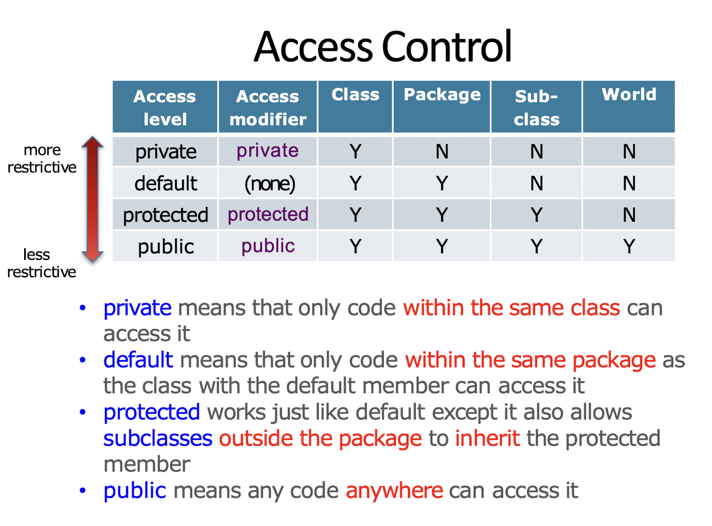
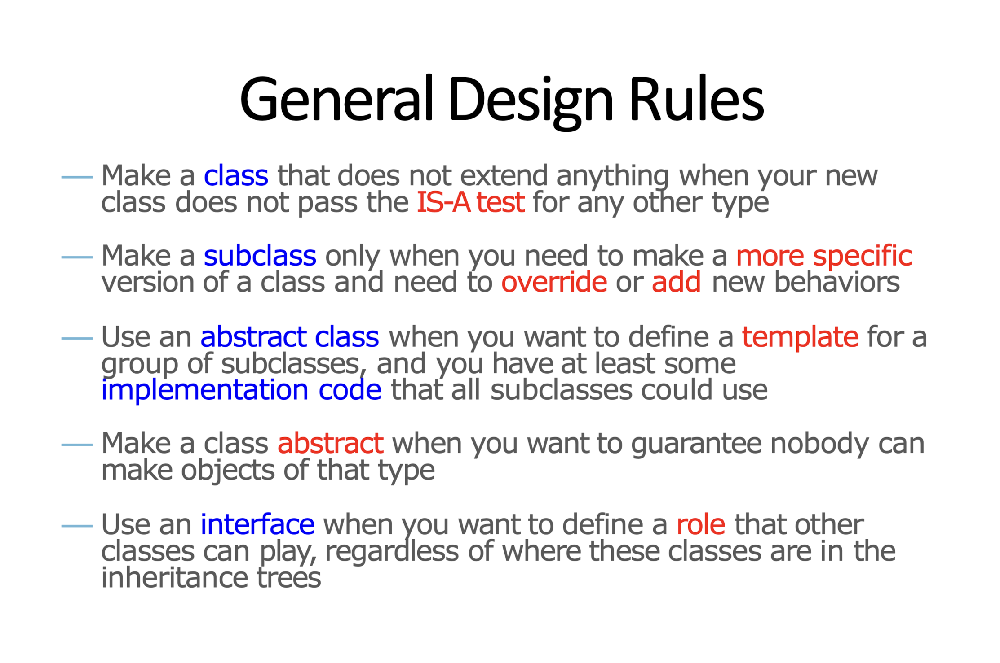

# COMP2396: Object-oriented Programming and Java

## Fundamental OOP Concepts 
1. Abstraction
2. Encapsulation
3. Inheritance
4. Polymorphism

## Advantages of OOP

**1. Modularity: Code can be written and maintained independently** \
**2. Information Hiding: Objects' internal implementation remains hidden** \
**3. Code re-use: The code for an existing object can be reused either directly or through inheritance** \
**4. Pluggability: Problematic objects can be easily replaced** 

## Class and Object

- Classes and objects are the basic building blocks in OOP
- A class is not an object, but a **blueprint** for an object
- An **instance** (object made from a certain class) would have:
  1. Some data stored: **state**
  2. Some operations it can do: **behavior**


## A Java Application

- Java is a language that is:
  - compiled
  - **strongly statically-typed** 
  - object-oriented 
  - run in Java Virtual Machine (JVM)
- A Java application is nothing but objects talking to each other
- In most Java application, the `main()` method only does 2 things:
  - Create an object (instantiation)
  - Call a method of the object

```java
public Hello {
    public static void main(String[] args) {
        System.out.println("hello, world");
    }
}
```
Comparing to c++:
```cpp
int main(int argc, char* argv[]) {
    std::cout << "Hello, world" << std::endl;
    return 0;
}
```

Points to note:
1. `main()` method in Java does not return any value
2. the name of the program is excluded from the arguments (`String[] args`)

### Garbage Collection in Java

- Java manages the memory for you
- Each time an object is created in Java, it goes into the heap (a **garbage-collectible heap**)
- The Garbage Collector in Java would remove unreachable objects (i.e., no reference variables to this object) automatically. (When the system is running low on memory)

## Variables in Java

In Java, data types can be classified into **primitives** and **object references**, which would determine the memory space and the way of interpreting the data stored in the variables.

### Variable declaration
- A variable is declared by specifying its type and name. e.g., `int x; Dog y;`
- Rules in naming variables
  - Don'ts:
    1. start with a number
    2. be a reserved keyword in Java (e.g., `int`, `byte`, `extends`,...)
  - Dos: (standard naming conventions)
    1. classes: begin with a capital letter
    2. variables/methods: begin with a lowercase letter
    3. symbolic constants: only capital letters
    4. names consisting of multiple words are joined together with each subsequent word begins with a capital letter (`lowerCamelCase`)

### Primitive variables

- Primitives: fundamental values including integers, booleans and floating point numbers.

- Java supports 8 primitive types

| Type | Bit depth | value range |
|------|-----------|-------------|
| 1. `boolean` | JVM-specific | false or true |
| 2. `char` | 16 bits | [0, 65,535] |
| 3. `byte` | 8 bits | [-128, 127] |
| 4. `short` | 16 bits | [-32768, 32767] |
| 5. `int` | 32 bits | [-2147483648, 2147483647] |
| 6. `long` | 64 bits | [-2^(63), 2^(63)-1]
| 7. `float` | 32 bits | varies |
| 8. `double` | 64 bits | varis |

- *Note: when assigning `float` to a variable, an `f` should be added behind the literal, or it will be treated as a `double`. 
- Assigning literals with a wider-range data types to a variable declared with a narrower-range data type is not allowed. However, type casting allows it to be done. (information loss may happen)
```java
int x = 24;
float f = 32.5; // type mismatch
byte b = (byte) x; // valid conversion
```

### Object References

- Hold bits that references the objects living in the *heap*
- A reference variable is like a remote control, and using the dot operator on a reference variable is like pressing a button on the remote control.

**Declaration, creation and assignment**
```java
Dog myDog = new Dog();
```


## State and Behavior

In OOP, each object would contain:
  1. Instance variables $\rightarrow$ state of object
  2. Methods $\rightarrow$ behavior of object
- Every instance is unique and may have its own state and behavior (Instances of the same class has the same set of methods, but they can behave differently depending on the values of the instance variables)
- Java uses **pass-by-value** mechanism for passing parameter into a method.
- Methods other than *constructors* must have a return type (including `void`)

### Getters and Setters: How to achieve encapsulation

- A getter is a method for getting the value of an instance variable
- A setter is a method for setting the value of an instance variable
- `public` getters and setters are provided for accessing the `private` instance variable from outside the object. 
    - This prevents instance variables from being changed to unacceptable values from outside the object
    - With getters, setters and private variables, ***encapsulation*** can be achieved.

```java
class Dog {
    private double size; // it cannot be accessed outside the object directly
    double getSize() { // getter
        return size;
    }
    void setSize(size) { // setter 
        if (size > 0) { // check if the input is valid
            this.size = size // assignment
        }
    }
```

### Constructors

- Called automatically on instantiation of an object, before assigning to a reference
- must have the same name as the class
- must not have any return type, not even `void`
- cannot be called using the dot operator
- If no constructor is defined for a class, the compiler assumes a default constructor
- A class may have more than one constructor as long as each constructor has a different argument list (order is important) $\rightarrow$ concept of **overloaded methods**
- The compiler will not assume the default constructor if one or more constructors have been defined.
```java
public class Duck {
    private int size = 30;
    private String name = "Donald";

    public Duck() {} // default constructor
    public Duck(int size) { this.size = size; }
    public Duck(String name, int size) {
        this.name = name;
        this.size = size;
    }
}
```
- When an object of a subclass in created, its constructor will immediately call its superclass's **no-argument constructor** up to `java.lang.Object` (the ultimate superclass) 
  - Thus constructors are not inherited
  - The compiler will raise error if a class inherits a class without a no-argument constructor 

*Solution 1:* provide a no-argument constructor
```java
public class Animal {
    public Animal(int n) { ... }
    public Animal() { ... } 
}
```
```java
public Pig extends Animal {
    private int size = 90;
    private String name = "Peppa";
}
```

*Solution 2:* explicit call to the constructor using `super`
```java
public class Animal {
    public Animal(int n) { ... }
}
```
```java
public Pig extends Animal {
    private int size = 90;
    private String name = "Peppa";
    public Pig {
        super(3); 
    }

}
```

### `static` keyword

1. Static variables
- shared by **all** instances of a class (i.e., one copy per class)
- initialized **only** when the class is first loaded
- can be accessed using the class name, e.g., `Math.PI` from `java.lang.Math`
- can be used inside static methods

2. Static methods
- cannot use **any** instance variables, not even within the same class
- cannot use non-static methods since they behave differently depending on the values of the instance variables
- are called using the class name, e.g. `Math.log(double a)` from `java.lang.Math`

### `final` keyword

1. Final variables
- value cannot be changed once initialized
- do not get a default value
- must be initialized at declaration by direct assignment or in the constructor
- can be used to define a constant using `public static final`:
  - must be initialized either at the time it is declared or in a static initializer

```java
// a static final variable
public class Foo {
    public static final int FOO_X;
    static { // runs before any static method can be called and before any static variables can be used
        FOO_X = 25;
    }
}
```

2. Final method
- a method that cannot be *overridden* in a subclass (relating to inheritance)
  
3. Final class
- a class that cannot be *extended* (cannot have any subclass)
  
### Instance and Static Variables
- Declared within a class
- Always get a default value if no value has been explicitly assigned to it. 
  - primitives: `0` or `0.0` or `false`
  - object references: `null`

### Local Variables
- Declared within a method
- Do **not** get a default value
- Must be initialized before use (will raise error otherwise)

### Comparing Variables
- comparing primitives: `true` if the **bit patterns** are the same (primitive types are unimportant)
- comparing objects: `true` if the two variables are referencing the same object on the heap


## Inheritance

### Designing an Inheritance Tree
1. Look for objects that have common attributes and behaviors
2. Design a class that represents the common state and behavior
3. Decide if a subclass needs behavior that is specific to that particular subclass type
4. Look for more opportunities to use abstraction by finding 2 or more subclasses that might share common behavior

### Access Levels



### Method Overriding
- When a subclass overrides a method, it must make sure that
  - argument list must be the same
  - return type must be compatible
  - cannot be less accessible (in terms of access level)

```java
public class Dog {
    public void makeNoise() {
        System.out.println("Woof!");
    }
}
public class Poodle extends Dog {
    @Override
    public void makeNoise() {
        System.out.println("Ruff! Ruff!");
        /*
        same argument lists: Empty
        same return types: void
        same access levels: public
        */
    }
}
```
- When a method is called on an object reference, the JVM starts walking up the inheritance hierarchy until it finds a match (from the bottom to the top)
- It is possible to call an overridden method of the superclass using the keyword `super` (`super.method()`)

### Method Overloading

- For overloaded methods, the argument lists must be different, while return types, and access levels could be different 
- It has nothing to do with inheritance and polymorphism

```java
public class Dog {
    public void makeNoise() {
        System.out.println("Woof!");
    }
}
public class Poodle extends Dog {
    public void makeNoise(int n) {
        for (int i = 0; i < n; i++) {
            System.out.println("Ruff! Ruff!");
        }
    }
}
```
### Benefits of inheritance
1. Avoid duplicate code by extending classes
2. Handle specialization by overriding methods
3. Define a common protocol for a group of classes


## Polymorphism

### The way polymorphism works
- The reference type can be a superclass of the actual object type
- Any object that is the subclass of the declared type of the reference variable can be assigned to that reference variable.
```java
Dog myDog = new Poodle();
/*
The reference variable type is declared as Dog,
but the object created is a Poodle object.
*/
```
### Benefits of Polymorphism
- Makes it possible to write code that does not have to change when new **subclass types** are introduced
    - e.g., the array can store any subclass of the specified class (polymorphic arrays)

```java
public class Vet {
    public void giveShot(Dog a) {
        a.makeNoise();
    }
}
public class PetOwner {
    public void start() {
        Vet v = new Vet();
        Poodle d = new Poodle();
        v.giveShot(d);
    }
}
```


## Abstract Classes and Interfaces

### Abstract Classes and Methods
**Abstract Classes:**
- It is forbidden to instantiate an abstract class object using the `new` operator
- When designing an inheritance tree, one must decide which classes are abstract and which are concrete 

**Abstract Methods:**
- An abstract class means the class must be extended, whereas an abstract method means the method must be overridden
- An abstract method has no method body, just ends with a semicolon.
- It is illegal to have an abstract method in a *non-abstract* class
- A **concrete** class in the inheritance tree must implement all abstract methods from its superclass 
- An **abstract** class may not implement all the abstract methods from its superclass 

```java
abstract class Animal { // abstract class
    public void makeNoise() { // non-abstract method
        System.out.println("...");
    }
    public abstract void eat(); // abstract method
}

```

### Interface: Solution to Multiple Inheritance

- Java does not allow multiple inheritance (the Deadly Diamond of Death), instead, it is achieved through **interface**.
- A class can implement multiple interfaces
- Like abstract class, interface cannot be instantiated
```java
public interface Pet {
    // interface methods are implicitly public and abstract
    void beFriendly();
    void play();
}
```
- A class implementing the interface must implement all the interface methods so that the JVM will not be confused about which of the 2 inherited versions it is supposed to call. 
```java
public class Dog extends Animal implements Pet {
    // implemented methods
    public void beFriendly() { ... }
    public void play() { ... }
    // normal overriding methods
    public void makeNoise() { ... }
    public void eat() { ... }
}
```

### Interface as a Polymorphic Type

An object can be treated by the role it plays, rather than by the class type from which it was instantiated. 

```java
class Dog extends Animal implements Pet {
    public void beFriendly() { ... };
    public void play() { ... };
}
class Cat extends Animal implements Pet {
    public void beFriendly() { ... };
    public void play() { ... };
}

public class InterfaceTest {
    public static void main(String[] args) {
        // interface typed reference variables --> classes that implemented that interface
        Pet d = new Dog();
        Pet c = new Cat();
    }
}
```



## Packages: `ArrayList`

### Arrays

- An array of primitives
```java
int[] nums = new int[4]; // instantiate an array object only
int[] nums = {6, 19, 44, 42}; // instantiate and assign values
```
- An array of objects
```java
Dog[] myDogs = new Dog[3]; // instantiate array only
myDogs[0] = new Dog(); // instantiate a Dog object
myDogs[1] = new Dog();
myDogs[2] = myDogs[0]; // reference the same Dog() object as myDogs[0]
```

- Limitations of arrays in Java
1. no methods
2. only one instance variable: `length`
3. size must be determined at the time of creation, and cannot be changed afterwards
4. data can be put into and read from an array using array syntax, but cannot be actually removed from the array

### `ArrayList`

- a class in the core Java library `java.util` (the API)
- Advantages:
1. dynamic list size
2. more methods allowed, including searching for, adding and removing items
- Declaration:
```java
ArrayList<MyType> myList = new ArrayList<MyType>();
```
- Methods:
1. `add(Object elem)`
2. `remove(int index)`
3. `remove(Object elem)`
4. `contains(Object elem)`
5. `isEmpty()`
6. `indexOf(Object elem)`
7. `size()`
8. `get(int index)`
9. ...

### Packages
- In the Java API, classes are grouped into packages like `ArrayList`
- Importance:
  - helps the overall organization
  - name-scoping that helps to prevent collisions of names
  - provide a level of security by allowing placing restrictions on code
- A class in Java has a full name = package name + class name
- To use a class in a package other than `java.lang`, the full name of the class must be specified (e.g., `java.util.ArrayList` every time you use it), unless the package has been imported using `import` statement
```java
import java.utils.*; 
```

## Wrapper Classes
- The type parameter of an `ArrayList` supports classes only, so wrapper class is used for every primitive type
- Wrapper classes are in the `java.lang` package

| Primitive Type | Wrapper Class |
|----------------|---------------|
| `boolean` | Boolean |
| `char` | Character |
| `byte` | Byte |
| `short` | Short |
| `int` | Integer |
| `long` | Long |
| `float` | Float |
| `double` | Double |

### Wrapping and Unwrapping
```java 
int i = 167;
Integer iWrap = new Integer(i); // wrapping
int iUnwrap = iWrap.intValue(); // unwrapping
```

### Autoboxing
- Performs the conversion from primitives to wrapper objects, and vice versa, automatically
- This feature blurs the line between primitives and wrapper objects
- That is: `int` $\Leftrightarrow$ `Integer`
- **\*Note**: if an `Integer` object is not referencing any valid `Integer` object, autoboxing would fail and result in a `NullPointerException`;

```java
Integer i;
int j = i; // will blow up at runtime 
```
### String to Primitive by parsing
- The wrapper classes have static parse methods that take a string and return a primitive value
- **\*Note**: If something that cannot be parsed as a certain primitive values is passed into a static parse methods, the program will throw a `NumberFormatException`:
```java
String t = "two";
int y = Integer.parseInt(t); // will blow up at runtime
```

### Primitive to String
- Two ways to turn a number into a string: concatenation and `toString()` method
```java
double d = 42.5;
String doubleString1 = "" + d; // Method 1: using concatenation
String doubleString2 = Double.toString(d);
```

### Number formatting

- Call `String.format()` to format string with numbers, e.g. `String s = String.format("Hello COMP%d", 2396)`

- Some common format specifiers
1. `%,d` - insert comma and format the number as a decimal integer
2. `%.2f` - format the number as a 2-decimal-place floating point
3. `%,5.2f` - insert comma and format the number as a 2-decimal-place floating point with a minimum of 5 characters
4. `%h` - format the number as a hexadecimal
5. `%c` - format the number as a character


